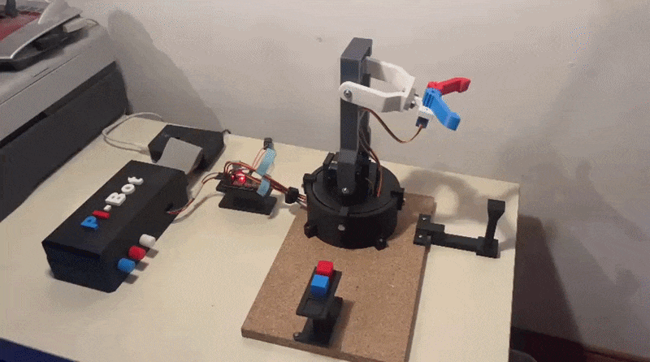
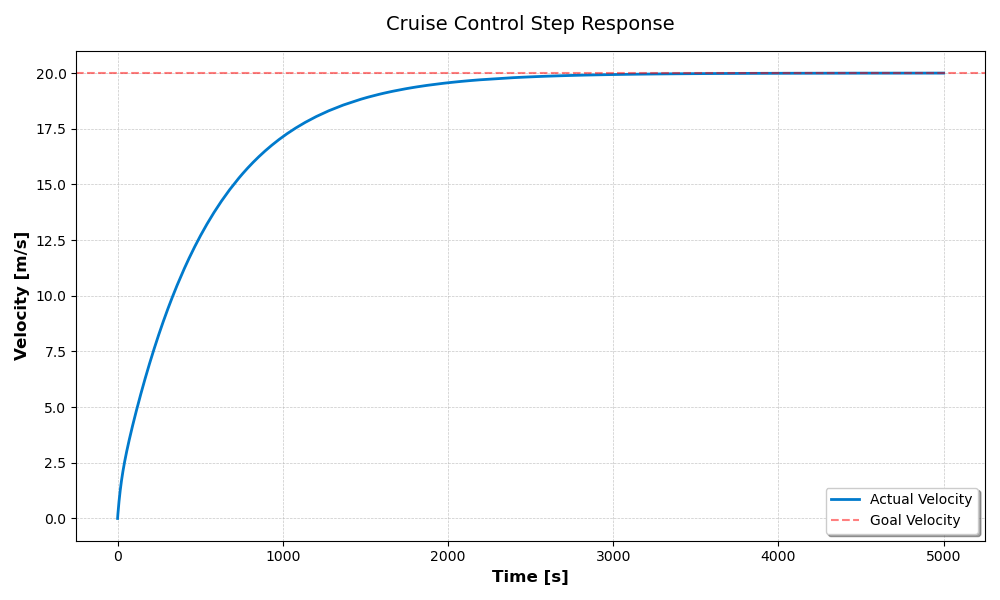

# Luca's Engineering Portfolio

Welcome to my GitHub portfolio!  
Here, I showcase my work completed during university and personal projects.
---

#  PI-Bot: Distributed 3-DOF Robotic Arm (Personal Project)

This [repository](https://github.com/BrenzingerLuca/robotic_arm_project) contains the full source code and hardware configuration for the PI-Bot, a custom-built 3-DOF robotic arm. Developed as an end-to-end solo project, it demonstrates the integration of distributed software systems, hardware control, and a hybrid robot control system.
The system is built on a distributed ROS2 architecture, where a workstation handles high-level motion planning and a Raspberry Pi 4 manages the low-level hardware abstraction layer.

## System Demo

  

## Technical Highlights & Implementation

This project covers the entire robotics stack, from mechanical coordination to high-level software orchestration:

*   **Distributed ROS2 Architecture:** Engineered a multi-node system where computation is split between a **PC (running MoveIt2 & GUI)** and a **Raspberry Pi 4 (Servo/ADC nodes)**, communicating seamlessly via **ROS2 Topics and SSH**.
*   **Hybrid Control System:** Developed two distinct operational modes:
    *   **GUI-Control:** Asynchronous trajectory execution using **MoveIt2 and PySide6**.
    *   **Hardware-in-the-Loop (HIL):** Real-time manipulation via **analog potentiometers**, allowing the user to "teach" the robot movements.
*   **Custom GUI (PI-Bot Control Center):** Designed and implemented a dashboard using **PySide6 (Qt)**. Key features include a **Sequence Recorder** to store/execute movement patterns and **real-time state synchronization** to prevent hardware jumps.
*   **Low-Level Hardware Interfacing:** Developed custom nodes for the **ADS7830 ADC (I2C)** and **PCA9685 PWM (I2C)** to bridge the gap between analog sensors and the digital ROS2 environment.
*   **Kinematics & Digital Twin:** Created a precise **URDF model** and configured the **TF-tree** for real-time visualization in **RViz**, ensuring the digital twin perfectly reflects the physical state of the 3-DOF arm.
*   **Motion Planning:** Integrated the **MoveIt2 framework** for **inverse kinematics (IK)** and collision-free path planning, utilizing custom service interfaces for **cartesian positioning**.
---
#  Autonomous Driving Project (University Project)

 

This [repository](https://github.com/BrenzingerLuca/autonomous_driving_project) contains the documentation and source code for our **autonomous driving system**, developed as part of a university course on **Introduction to ROS** during the summer term of 2025.

Our team engineered a comprehensive solution for self-driving within a simulated urban environment. The primary objective was to build a robust system capable of **real-time navigation, traffic light compliance, and collision avoidance** using **ROS (Robot Operating System)** and a **Unity-based simulator**.

## Key Learnings & Project Highlights

This project provided invaluable hands-on experience and a deep dive into advanced robotics and AI concepts:

*   **ROS (Robot Operating System):** Gained a strong understanding of ROS architecture, including node communication, topics, services, and the orchestration of complex robotic systems via launch files.
*   **Autonomous Driving Concepts:** Practical application of fundamental algorithms for perception in a simulated environment.
*   **Sensor Data Fusion:** Developed skills in processing, aligning, and fusing data from depth images and cameras to construct a comprehensive environmental model.
*   **Machine Learning for Perception:** Acquired practical experience in **fine-tuning and deploying YOLOv8 networks** for real-time object detection (specifically cars and traffic lights) in simulated scenarios.
*   **Git & Version Control:** Mastered collaborative codebase management using Git, including efficient handling of **large binary files with Git Large File Storage (Git LFS)** and maintaining a clean, effective project history.
*   **Team Collaboration:** Successfully navigated the complexities of agile team development, clearly defining responsibilities, and seamlessly integrating individual software modules into a cohesive system.

## My Contribution (Luca Brenzinger)

*   **Perception Module (Lead):** I led the design and implementation of key components within the perception pipeline. This included developing the `static_tf_ins_to_cameras` node for precise sensor frame transformations and configuring the `pointcloud.launch` file for robust 3D point cloud generation.
*   **YOLOv8 Network Fine-Tuning & Data Augmentation:** I made significant contributions to the fine-tuning of the **YOLOv8 object detection model**. My work involved setting up and executing **data augmentation strategies** to enhance model generalization and training the network on custom simulation data for accurate car and traffic light detection.
*   **Object Detector Node Development:** I actively developed and refined the `object_detector` node, which continuously processes incoming images to identify objects of interest, publishing their bounding box coordinates and class labels for downstream modules.
*   **3D Car Position Estimator Node:** My involvement extended to the `car_position_estimator` node, where I contributed to estimating 3D world positions of detected cars through depth-based triangulation and visualizing these results in RViz.
*   **Documentation:** I contributed to the comprehensive project documentation, providing detailed explanations of key modules and their functionalities to ensure clarity and maintainability.

---
# AI for Industry Challenge (Intrinsic Team Competition)

This [repository](https://github.com/BrenzingerLuca/AI-for-Industry-Challenge) contains our solution to Intrinsic's **[AI for Industry Challenge](https://www.intrinsic.ai/events/ai-for-industry-challenge)**: a robot arm autonomously plugging SFP and SC network connectors into their ports. Competing as a two-person team against groups of up to ten, we built two complete, very different insertion pipelines over two rounds — a fully self-trained vision pipeline for Qualification, then a force-controlled policy for Phase 1 once port detection was handled by Intrinsic's FlowState.

## System Demo
<table align="center">
  <tr>
    <td align="center"><video src="https://github.com/user-attachments/assets/24a9969e-ccff-41e1-bcb1-2e3e374ae856" width="360" controls></video> <em>SC insertion</em></td>
    <td align="center"><video src="https://github.com/user-attachments/assets/372e5b8e-c86d-4b76-b7c8-ba8532941530" width="360" controls></video> <em>SFP insertion</em></td>
  </tr>
</table>

## Results

| Round | Approach | Result |
|---|---|---|
| Qualification | Own vision pipeline (YOLO port detection + triangulation) | 27 / 160 teams advanced |
| Phase 1 | Intrinsic FlowState for perception, force-controlled insertion | **14 / 160 teams** |

## Key Highlights

*   **Custom Vision Pipeline (Qualification):** With no port detection provided, we labeled our own dataset and trained a **YOLOv8 keypoint model** to find each port's corners, then triangulated the multi-camera detections into a 3D port pose.
*   **Residual Offset-Correction Model:** Trained a vision-based regressor on data from our own capture pipeline to correct residual pose error right before insertion — reused unchanged across both rounds.
*   **Force-Controlled Insertion Policy (Phase 1):** Reworked the policy around **force control** after perception moved to FlowState — detecting contact, distinguishing a clean insertion from an edge catch, and recovering from snags without any camera input.
*   **Spiral Search Strategy:** A two-stage spiral search under soft stiffness for final alignment once the plug is near the port opening, used as a fallback in both pipelines.

---
# C++ Autonomous Cruise Control Simulator (Personal Engineering Project)

This [repository](https://github.com/BrenzingerLuca/PID-Controller) features a **C++ based simulation** of a vehicle's cruise control system, leveraging an **object-oriented architecture** to implement a discrete **PID controller**.

 
**Figure 1:** Shows the simulated step response (0 to 20 m/s) with tuned parameters ($K_p = 5.0, K_i = 0.1, K_d = 0.5$).

It originated as a group project at the **Technical University of Munich (TUM)**. I am currently refactoring and extending the codebase to deepen my **C++ knowledge** and improve the software architecture beyond the original academic submission. 
s
## Key Highlights

*   **Object-Oriented Implementation:** Clean separation of vehicle dynamics and PID control logic using an OOP approach.
*   **CMake Build System:** Professional project structure ensuring easy compilation and cross-platform compatibility.
*   **Simulation & Visualization:** Full simulation pipeline with CSV data export and Python-based plotting for performance analysis.
